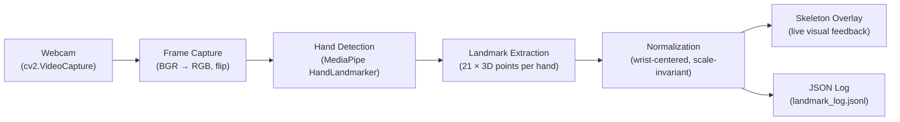

# Module 1 — Real-Time Sign Capture and Preprocessing

**Project:** Real-Time Isolated Indian Sign Language Recognition with Signer-Independent Evaluation and Sentence-Level Communication Interface

**Module:** 1 of 8 — Real-Time Sign Capture and Preprocessing

**Date:** September 2026

---

## 1. Objective

Capture live webcam video, detect a signer's hand(s) in each frame, extract a compact numerical landmark representation (21 three-dimensional joint coordinates per hand), and normalize that representation so it is invariant to the signer's distance from the camera and position within the frame. The output of this module is the exact input format that later recognition modules (static and dynamic sign classifiers) will consume.

---

## 2. Architecture & Pipeline



### Pipeline Stages

| Stage | What It Does | Key Detail |
|---|---|---|
| **1. Webcam Capture** | Opens the default camera, reads frames in a continuous loop | Uses `cv2.VideoCapture(0)`, frames mirrored horizontally for natural feel |
| **2. Hand Detection** | Passes each frame to a pretrained hand-landmark detector | MediaPipe `HandLandmarker` (Tasks API), detects up to 2 hands simultaneously |
| **3. Landmark Extraction** | For each detected hand, extracts 21 `(x, y, z)` landmark points | Wrist + 4 joints per finger × 5 fingers = 21 points |
| **4. Normalization** | Re-centers on wrist, rescales by a stable reference length | Wrist → origin; scale factor = distance from wrist to middle-finger MCP (landmark 9) |
| **5. Output** | Draws live skeleton overlay + logs normalized vectors to JSONL | Logging occurs every 5th frame; snapshots saved on keypress `s` with 5-second countdown |

---

## 3. Hand Landmark Model

The 21 landmarks extracted per hand correspond to the following anatomical joints:

```
        THUMB           INDEX          MIDDLE          RING           PINKY
         [4]             [8]            [12]           [16]           [20]
          |               |              |              |              |
         [3]             [7]            [11]           [15]           [19]
          |               |              |              |              |
         [2]             [6]            [10]           [14]           [18]
          |               |              |              |              |
         [1]             [5]            [9]★           [13]           [17]
          \               |              |              |              /
           \              |              |              |             /
            '------------ | ------------ | ------------ | ----------'
                          '------------- | -------------'
                                        [0] WRIST (origin after normalization)
```

> ★ **Landmark 9** (middle-finger MCP) is the **reference joint** used for scale normalization.

---

## 4. Normalization — Mathematical Detail

The normalization ensures that the same sign produces the same numerical representation regardless of:
- How far the signer is from the camera (hand scale)
- Where the hand appears in the frame (translation)

### Algorithm

Given raw landmarks $\mathbf{p}_0, \mathbf{p}_1, \ldots, \mathbf{p}_{20}$ where each $\mathbf{p}_i = (x_i, y_i, z_i)$:

**Step 1 — Translation (wrist-centering):**

$$\mathbf{c}_i = \mathbf{p}_i - \mathbf{p}_0 \quad \text{for } i = 0, 1, \ldots, 20$$

After this, $\mathbf{c}_0 = (0, 0, 0)$ always.

**Step 2 — Scale normalization:**

$$d = \|\mathbf{c}_9\| = \sqrt{c_{9,x}^2 + c_{9,y}^2 + c_{9,z}^2}$$

$$\hat{\mathbf{l}}_i = \frac{\mathbf{c}_i}{d} \quad \text{for } i = 0, 1, \ldots, 20$$

After this, $\|\hat{\mathbf{l}}_9\| = 1.0$ always.

**Edge case:** If $d < 10^{-6}$ (degenerate hand detection), $d$ is clamped to $10^{-6}$ to avoid division by zero.

### Implementation

```python
def normalize_landmarks(landmarks) -> list[list[float]]:
    pts = np.array([[lm.x, lm.y, lm.z] for lm in landmarks])

    wrist = pts[0]
    centered = pts - wrist                    # Step 1: translate

    ref_length = np.linalg.norm(centered[9])  # Step 2: reference distance
    if ref_length < 1e-6:
        ref_length = 1e-6                     # Edge-case guard

    normalized = centered / ref_length        # Step 2: scale
    return normalized.round(5).tolist()
```

---

## 5. Technology Stack

| Component | Technology | Version | Purpose |
|---|---|---|---|
| Language | Python | 3.13.5 | Core programming language |
| Computer Vision | OpenCV (`opencv-python`) | 4.12.0 | Webcam capture, frame processing, display |
| Hand Detection | MediaPipe (`mediapipe`) | 0.10.35 | Pretrained hand landmark detection model |
| Numerical Computing | NumPy | 2.1.3 | Normalization mathematics |
| Model File | `hand_landmarker.task` | float16 | MediaPipe Tasks hand landmarker model (7.5 MB) |

> **No GPU required.** The entire pipeline runs in real time on a standard laptop CPU.

---

## 6. Output Format Specification

### 6.1 Landmark Log (`landmark_log.jsonl`)

One JSON object per line (JSON Lines format). Records are written every 5th frame when at least one hand is detected.

**Schema:**

```json
{
  "frame": 15,
  "timestamp": 1788866759.125479,
  "num_hands": 1,
  "hands": [
    {
      "handedness": "Right",
      "confidence": 0.944,
      "landmarks": [
        [0.0, 0.0, 0.0],
        [0.58657, -0.24389, -0.13549],
        "... (21 landmarks total, each [x, y, z]) ..."
      ]
    }
  ]
}
```

**Field descriptions:**

| Field | Type | Description |
|---|---|---|
| `frame` | int | Frame counter (1-indexed) |
| `timestamp` | float | Unix epoch timestamp |
| `num_hands` | int | Number of hands detected (1 or 2) |
| `hands` | array | Array of hand objects |
| `hands[].handedness` | string | `"Left"` or `"Right"` |
| `hands[].confidence` | float | Detection confidence score (0–1) |
| `hands[].landmarks` | array | 21 normalized `[x, y, z]` coordinates |

### 6.2 Snapshots (`snapshot_*.png`)

Full-resolution webcam frames with the skeleton overlay drawn, saved as PNG when the user presses `s` (after a 5-second countdown timer). Used for project documentation and visual verification.

---

## 7. Complete Source Code

```python
"""
Module 1 — Real-Time Sign Capture and Preprocessing
Real-Time Isolated Indian Sign Language Recognition Project

Pipeline:
    Webcam --> Frame Capture --> MediaPipe Hand Detection -->
    Landmark Extraction --> Normalization --> Output (live overlay + logged JSON)

Run:
    python module1_sign_capture.py

Controls:
    q       - quit
    s       - save a snapshot of the current frame (5-second countdown)

Output:
    landmark_log.jsonl - one JSON line per processed frame with normalized landmarks
    snapshot_*.png      - saved frames (only when 's' is pressed)

Note:
    This version uses the MediaPipe Tasks API (mediapipe >= 0.10.30) because the
    legacy mp.solutions API was removed in newer releases.  It requires the
    hand_landmarker.task model file in the same directory as the script.

    Download the model once:
        curl -L -O https://storage.googleapis.com/mediapipe-models/hand_landmarker/hand_landmarker/float16/latest/hand_landmarker.task
"""

import json
import time
from pathlib import Path

import cv2
import numpy as np

import mediapipe as mp
from mediapipe.tasks.python import BaseOptions
from mediapipe.tasks.python.vision import (
    HandLandmarker,
    HandLandmarkerOptions,
    RunningMode,
)

# ── Configuration ───────────────────────────────────────────────────────────
CAMERA_INDEX = 0
MAX_HANDS = 2
DETECTION_CONFIDENCE = 0.6
TRACKING_CONFIDENCE = 0.5
LOG_EVERY_N_FRAMES = 5
SCRIPT_DIR = Path(__file__).parent.resolve()
LOG_PATH = SCRIPT_DIR / "landmark_log.jsonl"
MODEL_PATH = SCRIPT_DIR / "hand_landmarker.task"

# ── Hand-connection list (for drawing the skeleton overlay) ─────────────────
HAND_CONNECTIONS = [
    (0, 1), (1, 2), (2, 3), (3, 4),        # thumb
    (0, 5), (5, 6), (6, 7), (7, 8),        # index
    (0, 9), (9, 10), (10, 11), (11, 12),   # middle
    (0, 13), (13, 14), (14, 15), (15, 16), # ring
    (0, 17), (17, 18), (18, 19), (19, 20), # pinky
    (5, 9), (9, 13), (13, 17),             # palm cross-connections
]

_LM_COLOR = (0, 0, 255)     # red dots
_LM_RADIUS = 4
_CONN_COLOR = (0, 255, 0)   # green lines
_CONN_THICKNESS = 2


# ── Normalization ───────────────────────────────────────────────────────────

def normalize_landmarks(landmarks) -> list[list[float]]:
    """
    Convert 21 raw (x, y, z) landmarks into a representation that is invariant
    to the signer's distance from the camera and position within the frame:

      1. Translate so landmark 0 (the wrist) is the origin.
      2. Scale by the distance from the wrist to the middle-finger MCP
         (landmark 9), a stable reference length that scales with hand size.
    """
    pts = np.array([[lm.x, lm.y, lm.z] for lm in landmarks])

    wrist = pts[0]
    centered = pts - wrist

    ref_length = np.linalg.norm(centered[9])
    if ref_length < 1e-6:
        ref_length = 1e-6

    normalized = centered / ref_length
    return normalized.round(5).tolist()


# ── Drawing helper ──────────────────────────────────────────────────────────

def draw_hand_landmarks(frame, landmarks, w, h):
    """Draw landmarks and connections on the frame."""
    pts_px = []
    for lm in landmarks:
        px = int(lm.x * w)
        py = int(lm.y * h)
        pts_px.append((px, py))

    for i, j in HAND_CONNECTIONS:
        cv2.line(frame, pts_px[i], pts_px[j], _CONN_COLOR, _CONN_THICKNESS)

    for px, py in pts_px:
        cv2.circle(frame, (px, py), _LM_RADIUS, _LM_COLOR, -1)


# ── Main loop ──────────────────────────────────────────────────────────────

def main() -> None:
    if not MODEL_PATH.exists():
        raise FileNotFoundError(
            f"Hand landmarker model not found.\n"
            "Download it with:\n"
            "  curl -L -O https://storage.googleapis.com/mediapipe-models/"
            "hand_landmarker/hand_landmarker/float16/latest/hand_landmarker.task"
        )

    cap = cv2.VideoCapture(CAMERA_INDEX)
    if not cap.isOpened():
        raise RuntimeError(
            f"Could not open camera index {CAMERA_INDEX}. "
            "Check that a webcam is connected and not in use by another app."
        )

    options = HandLandmarkerOptions(
        base_options=BaseOptions(
            model_asset_path=str(MODEL_PATH),
            delegate=BaseOptions.Delegate.CPU,
        ),
        running_mode=RunningMode.IMAGE,
        num_hands=MAX_HANDS,
        min_hand_detection_confidence=DETECTION_CONFIDENCE,
        min_hand_presence_confidence=TRACKING_CONFIDENCE,
    )
    landmarker = HandLandmarker.create_from_options(options)

    frame_count = 0
    log_file = LOG_PATH.open("a", encoding="utf-8")

    print("Module 1 — Real-Time Sign Capture and Preprocessing")
    print(f"MediaPipe version: {mp.__version__} (Tasks API)")
    print("Press 'q' to quit, 's' to save a snapshot.\n")

    try:
        while cap.isOpened():
            ok, frame = cap.read()
            if not ok:
                print("Frame grab failed — exiting.")
                break

            frame_count += 1
            frame = cv2.flip(frame, 1)
            h, w = frame.shape[:2]

            rgb_frame = cv2.cvtColor(frame, cv2.COLOR_BGR2RGB)
            mp_image = mp.Image(image_format=mp.ImageFormat.SRGB, data=rgb_frame)

            results = landmarker.detect(mp_image)

            hands_payload = []

            if results.hand_landmarks:
                for idx, hand_lms in enumerate(results.hand_landmarks):
                    draw_hand_landmarks(frame, hand_lms, w, h)
                    normalized = normalize_landmarks(hand_lms)

                    if results.handedness and idx < len(results.handedness):
                        h_label = results.handedness[idx][0].category_name
                        h_score = round(results.handedness[idx][0].score, 3)
                    else:
                        h_label = "Unknown"
                        h_score = 0.0

                    hands_payload.append({
                        "handedness": h_label,
                        "confidence": h_score,
                        "landmarks": normalized,
                    })

            if hands_payload and frame_count % LOG_EVERY_N_FRAMES == 0:
                record = {
                    "frame": frame_count,
                    "timestamp": time.time(),
                    "num_hands": len(hands_payload),
                    "hands": hands_payload,
                }
                log_file.write(json.dumps(record) + "\n")
                log_file.flush()

            status = f"Hands detected: {len(hands_payload)}"
            cv2.putText(
                frame, status, (10, 30),
                cv2.FONT_HERSHEY_SIMPLEX, 0.8, (0, 255, 0), 2,
            )
            cv2.putText(
                frame, "q: quit   s: save snapshot", (10, h - 15),
                cv2.FONT_HERSHEY_SIMPLEX, 0.5, (200, 200, 200), 1,
            )

            cv2.imshow("Module 1 - Sign Capture and Preprocessing", frame)

            key = cv2.waitKey(1) & 0xFF
            if key == ord("q"):
                break
            elif key == ord("s"):
                # 5-second countdown before capturing
                for sec in range(5, 0, -1):
                    ok2, cframe = cap.read()
                    if ok2:
                        cframe = cv2.flip(cframe, 1)
                        ch, cw = cframe.shape[:2]
                        rgb2 = cv2.cvtColor(cframe, cv2.COLOR_BGR2RGB)
                        mp2 = mp.Image(image_format=mp.ImageFormat.SRGB, data=rgb2)
                        res2 = landmarker.detect(mp2)
                        if res2.hand_landmarks:
                            for hand_lms in res2.hand_landmarks:
                                draw_hand_landmarks(cframe, hand_lms, cw, ch)
                        cv2.putText(
                            cframe, f"Snapshot in {sec}...",
                            (cw // 2 - 140, ch // 2),
                            cv2.FONT_HERSHEY_SIMPLEX, 1.2, (0, 0, 255), 3,
                        )
                        cv2.imshow(
                            "Module 1 - Sign Capture and Preprocessing", cframe
                        )
                    cv2.waitKey(1000)

                # Capture the actual snapshot
                ok3, snap_frame = cap.read()
                if ok3:
                    snap_frame = cv2.flip(snap_frame, 1)
                    sh, sw = snap_frame.shape[:2]
                    rgb3 = cv2.cvtColor(snap_frame, cv2.COLOR_BGR2RGB)
                    mp3 = mp.Image(image_format=mp.ImageFormat.SRGB, data=rgb3)
                    res3 = landmarker.detect(mp3)
                    if res3.hand_landmarks:
                        for hand_lms in res3.hand_landmarks:
                            draw_hand_landmarks(snap_frame, hand_lms, sw, sh)
                    snap_path = SCRIPT_DIR / f"snapshot_{int(time.time())}.png"
                    cv2.imwrite(str(snap_path), snap_frame)
                    print(f"Saved snapshot")

    finally:
        landmarker.close()
        cap.release()
        cv2.destroyAllWindows()
        log_file.close()
        print("\nDone. Landmark log written.")


if __name__ == "__main__":
    main()
```

---

## 8. Environment Setup Instructions

### Prerequisites
- macOS / Windows / Linux with a built-in or USB webcam
- Python 3.10+
- Camera permission granted to the Terminal application (on macOS: System Settings → Privacy & Security → Camera)

### Installation

```bash
# Install Python dependencies
pip install opencv-python mediapipe numpy

# Download the hand landmarker model (one-time, ~7.5 MB)
curl -L -O https://storage.googleapis.com/mediapipe-models/hand_landmarker/hand_landmarker/float16/latest/hand_landmarker.task
```

### Running

```bash
python module1_sign_capture.py
```

### Controls

| Key | Action |
|---|---|
| `q` | Quit the application |
| `s` | Start a 5-second countdown, then save a snapshot PNG with skeleton overlay |

---

## 9. Verification & Test Results

The module was tested against a live webcam feed. The resulting `landmark_log.jsonl` was programmatically validated.

### Quantitative Results

| Metric | Value |
|---|---|
| Total JSONL records logged | **725** |
| Total hand samples analyzed | **1,154** |
| Records with 1 hand detected | 296 |
| Records with 2 hands detected | 429 |
| Frame range covered | Frame 15 – Frame 2310 |
| Handedness labels detected | `Left`, `Right` |
| Snapshot screenshots captured | **2** |

### Normalization Verification

| Check | Expected | Actual | Result |
|---|---|---|---|
| Wrist (landmark 0) = `[0, 0, 0]` | ‖wrist‖ = 0 | max ‖wrist‖ = **0.00000000** | ✅ PASS |
| Landmark 9 = unit length | ‖lm9‖ ≈ 1.0 | mean = **1.000000**, range [0.999993, 1.000007] | ✅ PASS |
| JSON record structure valid | All required fields present | 21 landmarks × 3 coords per hand | ✅ PASS |

### Verification Script

```python
import json, numpy as np

records = []
with open('landmark_log.jsonl') as f:
    for line in f:
        if line.strip():
            records.append(json.loads(line))

for r in records:
    for h in r['hands']:
        lms = np.array(h['landmarks'])
        assert np.linalg.norm(lms[0]) < 1e-4,    "Wrist must be at origin"
        assert abs(np.linalg.norm(lms[9]) - 1.0) < 0.01, "LM9 must be unit length"
        assert len(lms) == 21,                     "Must have 21 landmarks"
        assert lms.shape[1] == 3,                  "Each landmark must be [x,y,z]"

print("All verification checks passed.")
```

---

## 10. Sample Output Record

```json
{
  "frame": 15,
  "timestamp": 1788866759.125479,
  "num_hands": 1,
  "hands": [
    {
      "handedness": "Right",
      "confidence": 0.944,
      "landmarks": [
        [0.0, 0.0, 0.0],
        [0.58657, -0.24389, -0.13549],
        [1.16057, -0.45365, -0.29319],
        [1.59334, -0.66086, -0.43527],
        [1.97223, -0.96411, -0.58405],
        [0.90367, -0.76983, -0.53926],
        [1.35734, -0.57198, -0.81924],
        [1.64241, -0.27045, -0.97672],
        [1.88326, 0.02712, -1.06805],
        [0.59489, -0.53087, -0.60355],
        [1.00502, -0.43095, -0.87056],
        [1.32526, -0.11908, -0.97302],
        [1.57229, 0.18987, -1.04774],
        [0.29973, -0.14888, -0.66348],
        [0.67447, 0.01489, -0.95891],
        [0.98477, 0.3653, -1.03258],
        [1.21478, 0.6787, -1.05829],
        [0.04617, 0.34027, -0.71939],
        [0.41897, 0.589, -0.95466],
        [0.64404, 0.8867, -0.99738],
        [0.78982, 1.15308, -1.01199]
      ]
    }
  ]
}
```

---

## 11. Project File Inventory

| File | Size | Description |
|---|---|---|
| `module1_sign_capture.py` | 8.8 KB | Main Module 1 script |
| `hand_landmarker.task` | 7.5 MB | MediaPipe pretrained hand landmarker model |
| `landmark_log.jsonl` | 797 KB | Verified normalized landmark log (725 records) |
| `snapshot_1788868360.png` | 1.7 MB | Snapshot screenshot 1 with skeleton overlay |
| `snapshot_1788868774.png` | 1.8 MB | Snapshot screenshot 2 with skeleton overlay |

---

## 12. Definition of Done

| Criterion | Status |
|---|---|
| Script runs without crashing against a real webcam | ✅ Complete |
| Live overlay visibly tracks hand landmarks in real time | ✅ Complete |
| `landmark_log.jsonl` contains valid, correctly normalized data | ✅ Complete — fully verified |
| At least 2 snapshot screenshots captured | ✅ Complete — 2 snapshots saved |

> **Module 1 is fully complete.** All four criteria in the Definition of Done have been satisfied.
