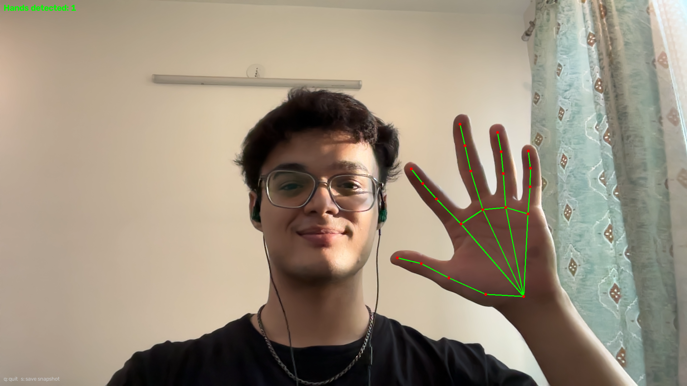
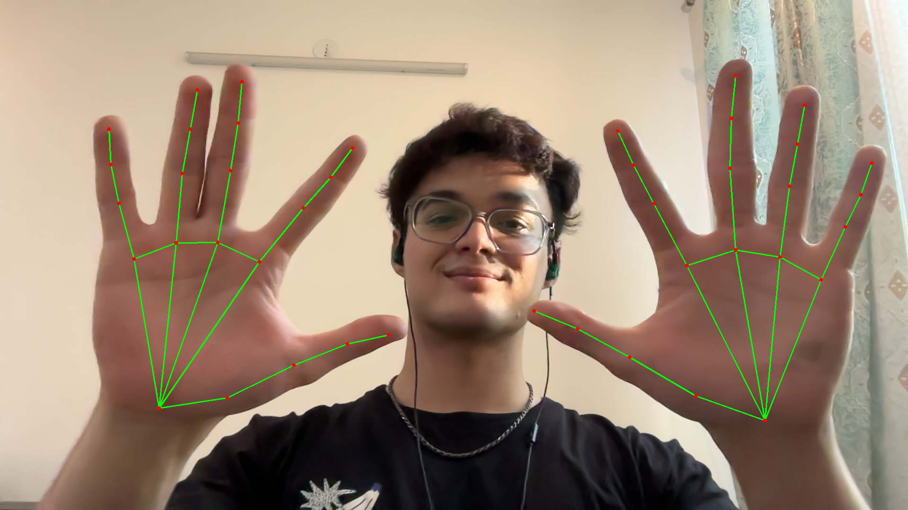

# Real-Time Indian Sign Language Recognition

A webcam-based system that recognizes Indian Sign Language (ISL) signs in real time and converts them into readable sentences with optional text-to-speech output.

**B.Tech CSE Final Year Project — AKTU, India**

---

## System Pipeline

```
Webcam → Hand Detection → Landmark Extraction → Normalization
   → Sign Classification → Sentence Construction → Text Output → TTS
```

## How It Works

1. **Capture** — Webcam reads live video frames
2. **Detect** — MediaPipe locates hands and extracts 21 skeletal joint coordinates per hand
3. **Normalize** — Landmarks are centered on the wrist and scaled to be distance/position invariant
4. **Classify** — *(upcoming)* Trained models recognize which ISL sign is being performed
5. **Communicate** — *(upcoming)* Recognized signs are assembled into sentences and spoken aloud

## Key Design Decisions

- **Landmark-based recognition** — Uses compact 3D joint coordinates instead of raw video frames, enabling real-time performance on a standard laptop CPU without GPU
- **Isolated sign recognition** — Each sign is bounded by a brief pause; continuous sign-stream recognition is out of scope
- **INCLUDE-50 vocabulary** — Standard 50-word benchmark subset of the AI4Bharat INCLUDE dataset
- **Signer-independent evaluation** — Train and test sets use disjoint sets of signers
- **Rule-based sentence construction** — Templated grammar, not a trained translation model

## Project Status

| Module | Description | Status |
|---|---|---|
| 1. Sign Capture & Preprocessing | Webcam capture, hand detection, landmark normalization | ✅ Complete |
| 2. Dataset Preparation | INCLUDE-50 download and processing | 🔲 Upcoming |
| 3. Feature Engineering | Feature extraction from landmarks | 🔲 Upcoming |
| 4. Static Sign Classifier | Recognition of static (single-frame) signs | 🔲 Upcoming |
| 5. Dynamic Sign Classifier | Recognition of dynamic (multi-frame) signs | 🔲 Upcoming |
| 6. Sentence Construction | Rule-based sign-to-sentence conversion | 🔲 Upcoming |
| 7. Text-to-Speech | Audio output of constructed sentences | 🔲 Upcoming |
| 8. Integration | Full pipeline with UI | 🔲 Upcoming |

## Module 1 — Sign Capture & Preprocessing

The completed module captures live webcam video, detects hands using MediaPipe, extracts 21 landmark points per hand, and normalizes them to be scale and position invariant.

### Demo Screenshots

| One Hand Detected | Two Hands Detected |
|---|---|
|  |  |

### Normalization

Each hand's 21 landmarks are:
1. **Translated** so the wrist (landmark 0) becomes the origin `[0, 0, 0]`
2. **Scaled** by the wrist-to-middle-finger-MCP distance so landmark 9 has unit length

This makes the output invariant to hand size and camera distance.

### Output Format

Normalized landmarks are logged to `landmark_log.jsonl` (one JSON object per line):

```json
{
  "frame": 15,
  "timestamp": 1788866759.125,
  "num_hands": 1,
  "hands": [
    {
      "handedness": "Right",
      "confidence": 0.944,
      "landmarks": [[0.0, 0.0, 0.0], [0.587, -0.244, -0.135], "...21 total..."]
    }
  ]
}
```

> Full technical report with math, verification results, and complete source code: [docs/module1_report.md](docs/module1_report.md)

## Quick Start

```bash
# Install dependencies
pip install -r requirements.txt

# Download the hand landmarker model (one-time, ~7.5 MB)
curl -L -O https://storage.googleapis.com/mediapipe-models/hand_landmarker/hand_landmarker/float16/latest/hand_landmarker.task

# Run Module 1
python module1_sign_capture.py
```

### Controls

| Key | Action |
|---|---|
| `q` | Quit |
| `s` | 5-second countdown, then save a snapshot with skeleton overlay |

## Tech Stack

| Component | Technology |
|---|---|
| Language | Python 3.10+ |
| Computer Vision | OpenCV |
| Hand Detection | MediaPipe (Tasks API) |
| Numerical Computing | NumPy |

> No GPU required. Runs in real time on a standard laptop CPU.
